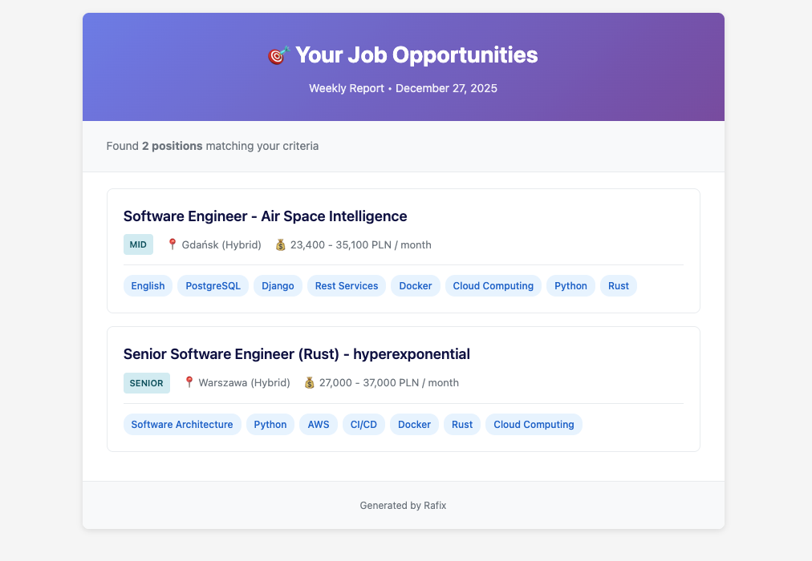

## Example
### Criteria
Show me jobs that require both Python and Rust and allow to work remotely or hybrid from Gdansk/Warsaw:
```python
criteria = [
    TechCriteria(
        keywords=[
            TechKeyword(name="Rust"), 
            TechKeyword(name="Python")
        ],
        rule=CriteriaRule.ALL,
    ),
    LocationCriteria(
        keywords=[
            LocationKeyword(form="hybrid", city="gdansk"),
            LocationKeyword(form="hybrid", city="warszawa"),
            LocationKeyword(form="remote"),
        ],
        rule=CriteriaRule.AT_LEAST_ONE,
    ),
]
```
### Example report produced



## Usage

```bash
make report
```


## Tasks
Features
- setup sending emails
- setup daily/weekly scheduler
- highlight the tech stack badges matching filters

Refactor
- Cache:
    - only individual urls, full board is downloaded always
    - for now store it to a file to be persistent across runs
    - each entry has: request url, time of creation, response
    - on each run the cache entries are pre-validated, and if any of them is there longer than X, it is removed and will be re-fetched
    - think about introducing some variability in cache entries lifetime
- Prepare for production:
    - docker (non-root user)
- Introduce additional criteria: salary, experience (exclude c-levels, exclude seniors, etc.)
- Deploy to the could: 
    - Render:
        - Deploy via dashboard by pasting image URL and setting port, done in 2 minutes. 
        - Free tier = 750h / month
        - spins down after 15 min idle
        - cron jobs via dashboard
    - fly.io: 
        - One command deploy
        - free tier: 3 shared VMs, 100k reqs/month
        - scheduling little bit more complicated than in Render
    - Oracle Cloud Always Free:
        - Free tier includes: 4 OCPUs (8vCPUs) + 24GB RAM machine with 3k OCPU hours and 18k GB hours / month
        - 4-OCPU VM running 24/7 for ~31 days uses 4 × 24 × 31 = 2,976 hours
        - GB hours track RAM: 24GB VM 24/7 for ~31 days = 24 × 24 × 31 = 17,856 hours—under 18,000
        - Can install cron and use cron jobs.
- Consider separating models exposed in API

Bugfix:
- Better error handling
- Handle pagination when there is a lot of offers
